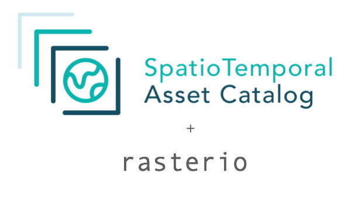

*From Metadata to Pixels*

## About

rio-stac-io is a [rasterio](https://github.com/rasterio/rasterio) extension to open STAC Items and ItemCollections using native GDAL drivers including [STACIT](https://gdal.org/en/stable/drivers/raster/stacit.html), [STACTA](https://gdal.org/en/stable/drivers/raster/stacta.html) and [GTI](https://gdal.org/en/stable/drivers/raster/gti.html). The library is build on top of rasterio and pystac.

## Installation and System requirements

You can install rio-stac-io using pip:

```
pip install rio-stac-io
```

When using the GTI driver you will need to install the `gti` extras. Your GDAL binaries also need to be compiled with geoparquet support.

```
pip install rio-stac-io[gti]
```

Please note that GDAL STAC support changes between different versions. For best support we recommend building rasterio against GDAL 3.10.2 and higher.

## Usage

:::rio_stac_io.open
    options:
        show_root_toc_entry: false
